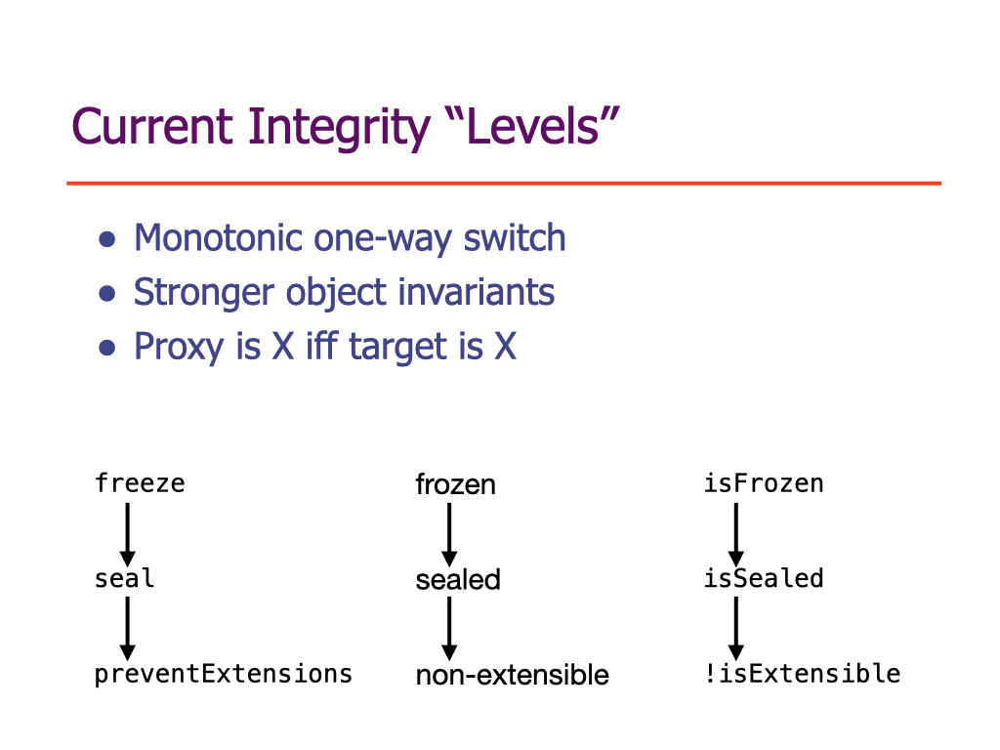
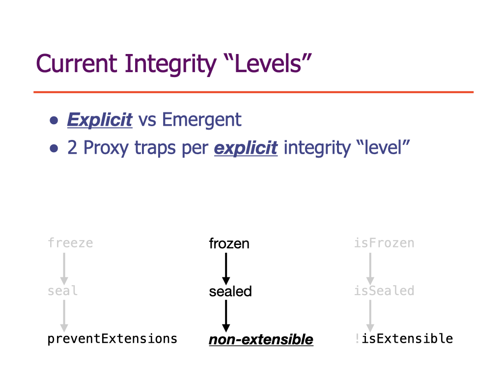
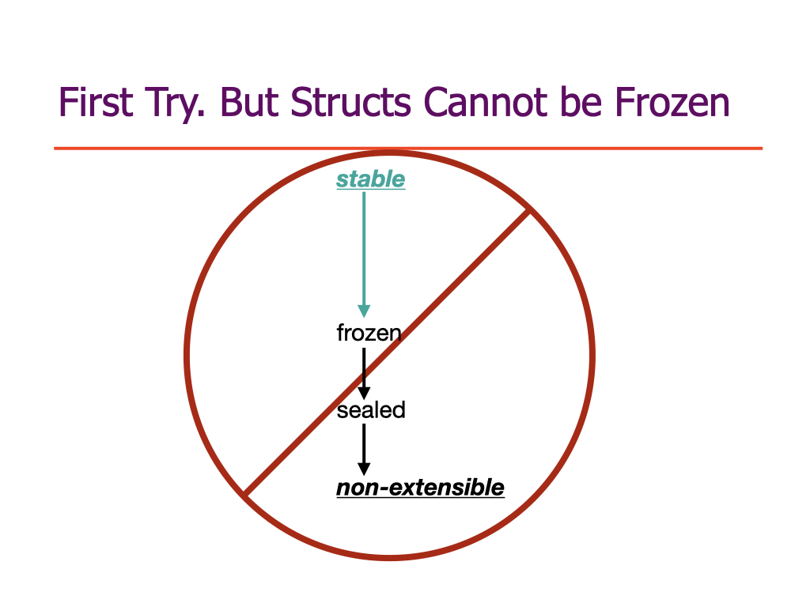
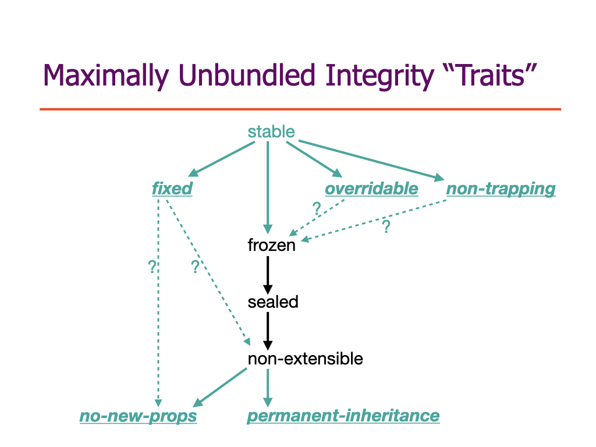
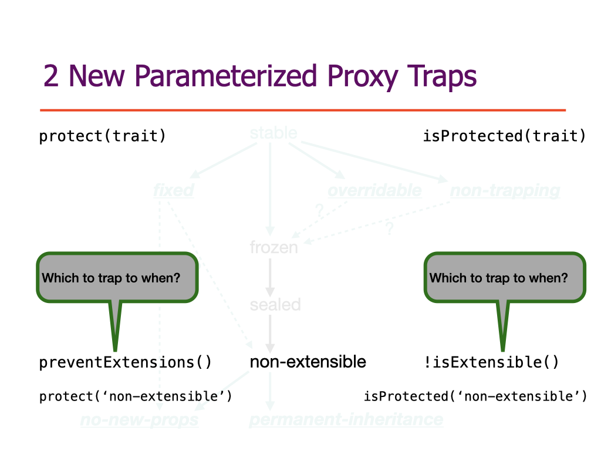
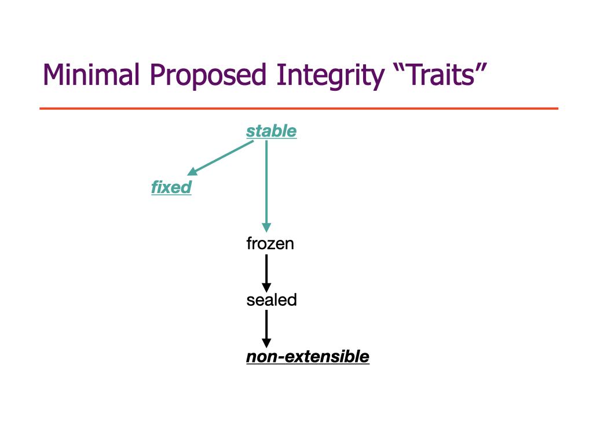

# proposal: Stabilize, and other integrity traits

Better support for high integrity programming by extending the existing system of integrity "levels".

Proposal for tc39 of new integrity "traits" for mitigating
- The assignment-override-mistake
- The return-override-mistake
- Proxy reentrancy hazards


## Status

**Stage**: 0

Co-champions:
- Mark S. Miller (@erights)
- Chip Morningstar (@fudco)
- Richard Gibson (@gibson042)
- Mathieu Hofman (@mhofman)

## Presentation history

- ***for stage 1*** - November 2024 structs working group ([slides.key](./stabilize-talks/stabilize-stage1-as-recorded-at-structs-group.key), [slides.pdf](./stabilize-talks/stabilize-stage1-as-presented-at-structs-group.pdf), [video](https://www.youtube.com/watch?v=VHr4Jvvt0vc))
- ***for stage 1*** - December 2024 tc39 plenary ([slides.key](./stabilize-talks/stabilize-stage1.key), [slides.pdf](./stabilize-talks/stabilize-stage1.pdf), [docs slides](https://docs.google.com/presentation/d/1474EreKln5bErl-pMUUq2PnX5LRo2Z93jxxGBNbZmco/edit?usp=sharing))

## Background

JavaScript currently has three integrity levels, *frozen*, *sealed*. and *non-extensible*. These are "levels" because they are currently in a fully-ordered hierarchy: All frozen objects are sealed, and all sealed objects are non-extensible. These are "integrity" levels because they support high integrity programming.

For example, [Hardened JS](https://hardenedjs.org/) and several other systems `freeze` the *primordial objects*, i.e., those built-in intrinsic objects that exist before code starts running. This supports higher integrity programming by, for example, preventing prototype poisoning, a major source of supply-chain vulnerability.

However, even for frozen objects, standard JavaScript has the following three unpleasant issues that we'd like to mitigate by introducing new integrity distinctions. These integrity distinctions would be in a partial order rather than a full order, so we shift our terminology to refer to all integrity distinctions as *integrity traits*. (The term is borrowed from a kind of multiple inheritance system, but here it applies to the spec-internal behavior definitions rather than user-level abstraction mechanisms.)

### The assignment-override-mistake.

```js
Object.freeze(Object.prototype);

function Point(x, y) {
  this.x = y; this.y = y;
}

Point.prototype.toString =
  function () {
    return `<${this.x},${this.y}>`;
  };
```

Leaving aside the `Object.freeze` on the first statement, there is a tremendous amount of legacy code on the web resembling the second two statements, where `Point` is a class-like constructor `function` whose instances inherit a `toString` method from `Point.prototype`. In this common legacy pattern, this `toString` method is defined by ***assignment*** to `Point.prototype`, to ***override*** the `Object.prototype.toString`, which the instances would otherwise have inherited.

However, in an environment in which `Object.prototype` is naive frozen, as in the first statement above, due to the assignment-override-mistake, the assignment in the third statement fails. In strict code it fails with a thrown exception. Even worse, in sloppy code, it fails silently, with the code then proceeding to misbehave. The assignment-override-mistake is that an inherited non-writable data property, such as the `Object.prototype.toString` property after the `freeze` cannot be overriden by assignment to an inheriting object, such as `Point.prototype`.

The ses-shim implementation of Hardened JS works around this problem for a limited set of primordial properties by first turning them into accessor properties whose setter emulates what the behavior of such an assignment would be had tc39 not made the assignment-override-mistake. However, we only do this for limited set because this technique is expensive, awkward, and non-transparent.

With this limited workaround, a tremendous amount of existing JavaScript code written with no awareness of Hardened JS nevertheless runs under Hardened JS compatibly. However, the vast majority of existing code that fails to run under Hardened JS fails because of the override mistake. Other systems that freeze the primordials report similar incompatibility. Some systems have given up on freezing primordials, and the resulting integrity benefits, due to these compatibility costs. Indeed, we find that ***the assignment override mistake is the greatest deterrence to higher integrity programming in JavaScript***.

After extensive investigation, we do not know of ***any*** non-test production code that intentionally makes use of the assignment-override-mistake. Thus, we still hope that it could simply be fixed language-wide without breaking the web. If this turns out to be possible, we would vastly prefer that over this proposal's approach to locally mitigate it, explained below. However, experiments to date did run into an accidental dependency, that still makes web breakage hard to evaluate (TODO links needed). This caused tc39 to back out of an earlier attempt to fix it language-wide. Hence the inclusion within this proposal.

### The return-override-mistake

```js
class Superclass {
  constructor(key) { return key; }
}

class Subclass extends Superclass {
  #value
  constructor(key, value) {
    super(key);
    this.#value = value;
  }
}

new Subclass(freeze(Object.prototype), 'a'); // private field added to primordial
```

The `Superclass` constructor above ends with an explict `return` statement. This has the peculiar effect that the subclass then treats this explicitly returned object as if it is an instance of the `Subclass`. In particular, in the subclass constructor the `super(key);` statement calls the `Superclass` constructor which returns `key`. The `Subclass` constructor then binds it to `this` and initializes it with a private `#value` field. This happens even if the `key` is a preexisting frozen object. The JavaScript spec explains this semantics as-if there is a hidden `WeakMap` within each such class definition. Indeed, [return-override-weakmap.js](./src/return-override-weakmap.js), which uses this technique to implement a `WeakMap`-like abstraction.

```js
new Subclass(struct, 'a'); // unpleasant shape change
```

This has several unpleasant consequences. All browser JavaScript implementations that we know of implements the addition of such internal fields by shape change of the object, much like their implementation of the addition of public properties. In v8, for example, both would involve change the object's so-called *hidden class*, which is internal bookkeeping for keeping track of objects with common shapes.

An engineering goals of [structs and shared structs](https://tc39.es/proposal-structs/) is that all instances of the same (class-like) struct definition have the same statically-knowable shape, enabling compilation of struct methods into higher speed code. However, this would conflict with uses of return override as above, with a struct as key, since the addition of the private field would cause a shape change. In theory this could be fixed in such engines at a cost in additional implementation complexity. This is a cost no one wants to pay to support a "feature" that likely no one wants to actually use anyway.

```js
harden(Subclass); // transitive `freeze`. Is `Subclass` pure?
const obj = freeze({}); // `obj` is clearly pure
new Subclass(obj, 'a'); // private field added to frozen object
```

In a confinement scenario, where Alice, Bob, and Carol are three programs, if Alice runs first, loads Bob and Carol in separately confined compartments, where they share only pure objects, i.e., objects with no mutable state, Bob and Carol should not be able to use these pure objects to communicate. We certainly want to consider a simple prozen object like `freeze({})` to be pure. If a class is transitively frozen, i.e., if the class and all objects transitively reachable from it by property and inheritance walk are frozen, and the code of the class has not lexically captured anything mutable, then we'd like, for purposes of security analysis, to consider such a class to be pure. Indeed, the purity predicate built into the Moddable XS implementation does consider both of these to be pure.

But because of the return-override-mistake, Bob and Carol could communicate given only such a pair. Where is the mutability enabling this communications? The only possible answer today is that the hidden weakmap within the subclass implementation is the source of mutability. Any subclass that declares a private field and inherits from a superclass that *might* engage in return-override to provide a pre-existing object would need to be considered impure. But this would break the alignment in Moddable XS between purity and the ability to store such classes in ROM. It would mean that a module that exports only such classes would itself need to be considered impure, even if it could not in practice enable communications. This inhibits sharing of such effectively-pure modules between programs, such as Bob and Carol, that should not be able to communicate.

```js
new Subclass(representative, 'a'); // makes gc of virtual objects observable
```

The Agoric platform provides the abstraction mechanisms for defining virtual objects, a kind of virtual memory for objects, where the number of such objects can vastly exceed what can pratically be stored in the JavaScript engine's in-memory heap. Like pages in a virtual memory system, such objects are primarily represented in longer term external storage and "paged in" on demand. In the analogy, the equivalent of a paged-in physical page is a *representative* -- a regular JavaScript object that represents the virtual object, and continues to represent it as long as it is not collected by the language engine's garbage collector. When such a representative is collected, the virtual object still exists in external storage, to be paged back in on demand.

To maintain the illusion that all these objects are as-if in the language's heap, we need to be careful about object identity, as tested for example by `===`. For `===` specifically, it suffices to ensure that a virtual object never has more that one representative alive at a time. Although each representative has a unique identity at the JavaScript implementation level, `===` can never compare two representatives of the same virtual object because it can only compare objects it retains simultaneously during the comparison. Likewise for object identity comparisons by `Object.is`, `Map`, and `Set`. In particular, a `Map` retains its keys, so a representative used as a key in a `Map` will not be collected.

The problem arises when a representative is weakly held. There are three mechanisms in JavaScript by which objects can be weakly held:
- `WeakRef` and `FinalizationRegistry`. Our virtual object system reserves these to itself, and does not provide even a virtualization of these to programs running within the virtual object system.
- `WeakMap` and `WeakSet`. If the real `WeakMap` constructor was available to programs running in the virtual object system, a representative as a key could be collected, dropping the association to some value. If the virtual object gets paged back in, the new representative will not be found in that WeakMap, breaking the illusion.

    To uphold the illusion, on initialization, our virtual object system reserves the real `WeakMap` and `WeakSet` constructors to itself, but provide substitute *virtualization-aware* `WeakMap` and `WeakSet` constructors. For non-representative keys, these pass through to the hidden real `WeakMap` and `WeakSet`. For representatives, it collaborates with the virtual object storage system to act as if the virtual object is the key, preserving the association past the lifetime of any one representative.

- The return-override-mistake, which makes weakmap-like functionality ***reachable by syntax***, and therefore not pratically virtualizable. If return-override is used with a virtual-object representative as key, the installed private field will observably disappear whenever the representative happens to be colleected, to be succeeded by a new representative. Virtualizing this hidden weakmap-like functionality would instead necessitate a painful rewrite to remove all class private fields from the target language. This is too costly to be practical.

```js
new Subclass(window, 'a'); // fails only on browser global `windowProxy` object
```

Due to the way browsers implement the browser global `windowProxy` object, it would be painful for them to support the addition of private fields demanded by the return-override-mistake. Instead, as a special dispensation, the browser global `windowProxy` object specifically is exempt from this requirement.

Such a special exemption is an awkward complexity for a language spec, violates the principle of least surpise, and makes it impractical to perfectly emulate the browser global `windowProxy` object using any other object, including the global object of a constructed realm or compartment.

### Proxy Reentrancy Hazards

```js
function foo(suspect) {
  if (!recordLike(freeze(suspect)))
    throw Error(...);
  // ... suspend invariant ...
  ... suspect.bar ...
  // ... restore invariant ...
}

foo(new Proxy({ bar: 3 }), {
  get() { foo({}); }
});
```

For defensive programming we often write functions like `foo` above that check arguments, and then proceed with the body of the function once all arguments have been validated to meet expectations. During the body of the function, there are often sections where some invariant is temporarily suspended, to be restored soon afterwards. For example, a function that splices a doubly linked list must go through a moment where the doubly linked list is malformed. This interval when invariants are suspended is very delicate, and the author should ensure that they only do things they are confident is safe to do during this interval.

In the example, the author of `foo` first attempts to validate that `suspect` is a record-like frozen plain data object. Had the [records and tuple proposal](https://github.com/tc39/proposal-record-tuple) happened, we could imagine the `recordLike` predicate would simply check `typeof suspect === 'record'`, in which case we would know that `suspect` was primitive data, as safe to access as any other JavaScript primitive data. We could be confident that the `suspect.bar` expression was safe to evaluate even while `foo`'s invariants are suspended, because we'd know that it could not cause the interleaving of other code carried along by `suspect`.

Inspired by the [records and tuple proposal](https://github.com/tc39/proposal-record-tuple), Endo provides an [`isRecord`](https://github.com/endojs/endo/blob/master/packages/pass-style/src/typeGuards.js#L23) predicate that does as much record-like safety validation as it can in standard JavaScript today. It checks that the object is frozen, inherits directly from `Object.prototype`, and has only string-named own enumerable data properties. Ideally, all this validation would assure `foo`'s author that the expression `suspect.bar` is similarly safe.

Unfortunately, within standard JavaScript, we have no way to validate that `suspect` is not a proxy, or to ensure that it is not. If it is a proxy, it would still be constrained by the [object invariants](https://tc39.es/ecma262/multipage/ecmascript-data-types-and-values.html#sec-invariants-of-the-essential-internal-methods) to act like a frozen object. The object invariants together with the `recordLike` predicate would guarantee that every time `suspect.bar` is evaluated successfully, it evaluates to the same value. But if `suspect` is a proxy, during that property access it could still execute other code, including code that reenters `foo` while `foo` is unprepared to be reentered.

Within standard JavaScript today, the only way the author of `foo` can protect against this is either to require that the argument is primitive data (such as a string), or to do a defensive copy up front, before suspending invariants, creating new objects that are known *by construction* to be safe plain data objects. Such defensive copying is expensive. Pervasively defensive programming would require pervasive defensive copying, which is exhorbitantly expensive.

## New Integrity Traits



We wish to mitigate the three problems above by introducing new integrity traits. But what makes a proposed new feature to be an integrity trait? We propose the following requirements, already followed by the existing integrity traits:
- Monotonic one-way switch. For example, once an object is frozen, it is forever frozen.
- Stronger object invariants, better support for higher integrity programming. For example, we know that the value of an own data property of a frozen object cannot change, even if that object is a proxy or any other exotic object.
- A proxy has a given integrity trait *if and only if* its target has that same integrity trait. For example, a proxy is frozen if and only if its target is frozen. This preserves the feature that *all* the bookkeeping for a proxy's integrity traits are only whether the target has those traits.



```js
> const obj = { x: 8 };
> !Object.isExtensible(obj); // false
> Object.isSealed(obj);      // false

> Object.preventExtensions(obj);
> !Object.isExtensible(obj); // true
> Object.isSealed(obj);      // false

> delete obj.x;
> !Object.isExtensible(obj); // true
> Object.isSealed(obj);      // true
```

Again generalizing from the existing integrity traits, we can divide integrity traits into
- ***Explicit***, such as non-extensible, where the flag of whether a given object is non-extensible is fundamental semantic state that any implementation must explicitly represent. An object only becomes non-extensible if it is explicitly made non-extensible by applying an operation that causes it to become non-extensible.
- ***Emergent***, such as sealed or frozen, where an object has that integrity trait only if a conjunction of other monotonic conditions holds, irrespective of how that conjunction became true. In the example above, `obj` becomes sealed when its own configurable data property is deleted.

Proxies only need traps for the explicit integrity levels. Indeed, proxies have traps for `preventExtensions` and `isExtensible`, but have no traps for sealed or frozen.

### An explicit *Stablize* would mitigate all three problems



We first thought to introduce just one new explicit integrity trait, *stable*, to mitigate all three problems, where all stable objects were frozen. However, this would fail to enable [structs and shared structs](https://tc39.es/proposal-structs/) to have efficient fixed-shape implementations. Structs and shared structs are born sealed, but they are not born frozen. But they could only have a fixed shape implementation if they are also born exempt from the return-override mistake.

We would also be unable to retroactively rationalize the browser global `windowProxy` objects exemption from the return-override-mistake, nor enable faithful emulations using other objects, since none of these objects would normally even be non-extensible.



Going to the other extreme, let's consider a full unbundling of integrity trait features into separate traits. In this diagram, the underlined bold italic itemps are the explicit integrity traits, the others would be emergent traits, and the arrows are the implication arrows among them. In this fully unbundled picture, each explicit trait only does one job, and they are more orthogonal to each other.
- ***fixed*** - A fixed object would be exempt from the return-override mistake. The new behavior would follow the existing precedent of the browser global `windowProxy` object, so that we could retroactively rationalize it as carrying the fixed trait, and emulations could also be fixed to behave similarly. Structs would be born both sealed and fixed, but not frozen. There is no technical reason for fixed to imply any other integrity trait, though there may be adequate esthetic arguments.
- ***overridable*** - An overridable object would be exempt from the assignment override mistake. This is easiest to specify if overribale implies frozen. We'd simply say that any data property inherited from an overridable object can be overridden by assignment. If overridable does not imply frozen, then it would only change the behavior of either non-writable data properties, or only non-writable non-configurable data properties. This would enable overridable to work for objects in which only some properties were non-writable.
- ***non-trapping*** - Non-trapping is *much* easier to specify (and likely implement) if non-trapping implies frozen, which we will assume here. In that case, a non-trapping object used as a proxy target would cause that proxy never to trap to its handler. Recall that if the target is frozen, the handler traps already cannot change the contents of a successful result. All they can do is interleave other code during the trap, raising reentrancy hazards, or throw, preventing a successful result from being reported. If the target is additionally non-trapping, then the proxy would act as if the handler had no traps, forwarding all operations onto the target. In other words, such a proxy would act exactly like its target in all ways except that it would have a distinct object identity. Following our earlier principles, such a proxy would itself be non-trapping.

```js
function foo(suspect) {
  if (!recordLike(beNonTrapping(suspect)))
    throw Error(...);
  // ... suspend invariant ...
  ... suspect.bar ...
  // ... restore invariant ...
}

foo(new Proxy({ bar: 3 }), {
  get() { foo({}); }
});
```

An object that is non-trapping might still raise reentrancy hazards if it has accessor properties, or if it inherits from an object that itself raises reentrancy hazards. But if `recordLike` first checked that its argument is non-trapping, in addition to all its other checks, then it would indeed guarantee that a passing object is a record-like plain data object that cannot interleave any foreign code during property access, and thereby cannot raise reentrancy hazards.

Like proxies, exotic objects are allowed to observably interleave user code or visible effects during access to alleged data properties. Indeed, the module namespace object of the [import defer proposal](https://docs.google.com/presentation/d/1yFbqn6px5rIwAVjBbXgrYgql1L90tKPTWZq2A5D6f5Q/edit#slide=id.p) would do so. An exotic object, like a proxy, can also refuse an attempt to impose a new explict integrity trait on it. A growable array-buffer refused to be made non-extensible. An exotic object that wishes to preserve this observable interleaving of user code or visible effects during property access would must refuse to be made non-trapping.

This successfully mitigates the proxy reentrancy hazards without introducing a predicate to tell whether an object is a proxy, which would threaten practical membrane transparency. Rather, `recordLike` only needs a predicate to detect whether an object is non-trapping. As with any other integrity trait, this would be transparently reflected from targets to their proxies.

### Unbunding non-extensible

As long as we're considering an extreme unbundling of integrity traits, we could also consider unbundling non-extensible into the explicit orthogonal traits of
- ***permanent-inheritance*** - only provides the feature on non-extensible of locking in what an object inherits from. The benefit is again retroactive rationalization and ability to virtualize. `Object.prototype` is both inheriting from `null`. By special dispensation, this cannot be changed, even though `Object.prototype` is born extensible. Likewise, by special dispensation, it is impossible to change which other the browser global `windowProxy` object inherits from. Because this ability is unavailable to non-proxy objects, they cannot be used to faithfully emulate the browser global `windowProxy` object.

    By unbundling this feature of non-extensible into a separate explict integrity trait, we could retroactively rationalize both of these, and enable more faithful emulation of the browser global `windowProxy` object.

- ***no-new-props*** - just completes the unbundling, by extracting the remaining feature of non-extensible into a sparate explicit trait. A no-new-props object would be one that cannot grow any new own properties, even though we might still be able to change what object it inherits from.



With five new explicit integrity traits, it seems we'd need ten new proxy traps. One each to request the integrity trait, and one each to test the integrity trait. This seems too much. Instead, we could introduce just two new parameterized proxy traps, `protect(traitName)` and `isProtected(traitName)`, where the names range only over the explict integrity trait names.

If we unbundle non-extensible in this way, then non-extensible itself becomes an emergent integrity trait. This raises the compatibility conundrum of what how the existing `preventExtensions` and `isExtensible` proxy traps relate to the new ones. Under what circumstances for an operation on the proxy trap to which handler? We leave this question open for now.

### Unbundling and rebunding stable

In this fully unbundled picture, stable would be emergent, but would still be strongest. Stable would still imply all the other integrity traits. [Hardened JS](https://hardenedjs.org/) would still shift to stabilizing all the primordials, rendering them frozen, exempt from the return-override-mistake, the assignment-override-mistake, and proxy reentrancy hazards. Each element help high integrity program, by preventing rude non-local surprises.

However, it makes less sense to keep non-trapping below stable. We initially thought to make non-trapping imply frozen, because one a proxy's target is frozen, the handler no longer has much utility. But if there are integrity levels not implied by non-trapping, then once an object is non-trapping it would no longer be able to intercept an attempt to make it, for example, fixed or overridable, or to test whether it is fixed or overridable. It seems that stable and non-trapping must each imply the other, suggesting that non-trapping should be bundled back into stable, and that stable thereby becomes explicit.

Although orthogonality is nice, many uses of these integrity traits will only want to use pleasant bundles. If we rebundle as much as possible, while still meeting our compelling use cases, we lose orthogonality, but we potentially have a system that is easier to understand and to implement. What is this minimal picture?



This resembles our first try, with the one difference that the fixed trait, for mitigating the return-override-mistake, is broken out. Stable would still imply fixed, but an object could still be fixed without application of any of the other traits. This picture also omits the unbundling of non-extensible merely because the need does not currently seem compelling enough to be worth the cost. The main benefit would be retroactive rationalization of the permanent-inheritance behavior of `Object.prototype` and the browser global `windowProxy` object, as well as enabling a more faithful emulation of `windowProxy` without using a JavaScript proxy.

The most plausible re-unbundling from here would be to again break out overridable and not make it imply frozen. This would mitigate the assignment-override-mistake for non-writable properties inherited from non-frozen objects. This is certainly coherent and simple to understand. This seems like a good question to investigate in Stage 1.
